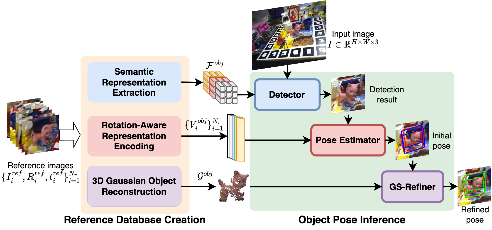

# GS-Pose: Cascaded Framework for Generalizable Segmentation-based 6D Object Pose Estimation

- [Paper](https://arxiv.org/abs/2403.10683)
<p align="center">
    
</p>

``` Bash
@inproceedings{cai_2024_GSPose,
    author    = {Cai, Dingding and Heikkil\"a, Janne and Rahtu, Esa},
    title     = {GS-Pose: Cascaded Framework for Generalizable Segmentation-based 6D Object Pose Estimation},
    journal   = {arXiv preprint arXiv:2403.10683},
    year      = {2024},
}
```

## Setup
Please start by installing [Miniconda3](https://conda.io/projects/conda/en/latest/user-guide/install/linux.html) with Pyhton3.8 or above.


``` Bash
git clone https://github.com/dingdingcai/gs-pose.git --recursive
cd gs-pose
conda env create -f environment.yml
conda activate gspose
```

# cd submodules/Connected_components_PyTorch
# python setup.py install

# cd ../diff-gaussian-rasterization
# python setup.py install

# cd ../simple-knn
# python setup.py install
# cd ../..

```
<!-- - Install the [3D Gaussian Splatting](https://github.com/graphdeco-inria/gaussian-splatting?tab=readme-ov-file) -->


<!-- ## Dataset
Our evaluation is conducted on three benchmark datasets all downloaded from [BOP website](https://bop.felk.cvut.cz/datasets). All three datasets are stored in the same directory, e.g. ``BOP_Dataset/tless, BOP_Dataset/ycbv, BOP_Dataset/itodd``, and set the "DATASET_ROOT" (in config.py) to the BOP_Dataset directory.

## Denpendencies
This project requires the evaluation code from [bop_toolkit](https://github.com/thodan/bop_toolkit). -->

## Pre-trained Model
Download the [pretrained weights](https://drive.google.com/file/d/1VgOAemCrEeW_nT6qQ3R12oz_3UZmQILy/view?usp=sharing) and store it as ``checkpoints/model_wights.pth``.

<!-- The pre-trained models can be downloaded [here](https://1drv.ms/u/s!AsQt5otkUsREavqKuyVqXeS0twA?e=pkyqow), all the models are saved to the ``checkpoints`` directory, for example, ``checkpoints/tless, checkpoints/ycbv, checkpoints/itodd``. -->


## Datasets
(Training) We utilize a subset (``gso_1M``) of the MegaPose dataset for training.
- Download the ``gso_1M`` dataset from [``MegaPose``](https://github.com/megapose6d/megapose6d?tab=readme-ov-file), preprocess it in the [BOP format](https://github.com/thodan/bop_toolkit/blob/master/docs/bop_datasets_format.md), and store it the directory ``MegaPose``.

Our evaluation is conducted on the LINEMOD and OnePose-LowTexture datasets. 
- For comparison with Gen6D, download [``LINEMOD_Gen6D``](https://connecthkuhk-my.sharepoint.com/:f:/g/personal/yuanly_connect_hku_hk/EkWESLayIVdEov4YlVrRShQBkOVTJwgK0bjF7chFg2GrBg?e=Y8UpXu). 
- For comparion with OnePose++, download [``lm``](https://bop.felk.cvut.cz/datasets) and the YOLOv5 detection results [``lm_yolo_detection``](https://zjueducn-my.sharepoint.com/:u:/g/personal/12121064_zju_edu_cn/EdodUdKGwHpCuvw3Cio5DYoBTntYLQuc7vNg9DkytWuJAQ?e=sAXp4B).
- Download the [OnePose-LowTexture](https://github.com/zju3dv/OnePose_Plus_Plus/blob/main/doc/dataset_document.md
) dataset and store it under the directory ``onepose_dataset``.


All datasets are organised under the ``dataspace`` directory, as below,
```
dataspace/
├── MegaPose
│
├── LINEMOD_Gen6D
│
├── bop_dataset/
│   ├── lm
│   └── lm_yolo_detection
│
├── onepose_dataset/
│   ├── scanned_model
│   └── lowtexture_test_data
│
└── README.md
```

## Evaluation
Evaluation on the subset of LINEMOD (comparison with Gen6D, Cas6D, etc.).
- ``python inference.py --dataset_name LINEMOD_SUBSET  --database_dir LMSubSet_database --outpose_dir LMSubSet_pose``

Evaluation on all objects of LINEMOD using the built-in detector.
- ``python inference.py --dataset_name LINEMOD  --database_dir LM_database --outpose_dir LM_pose``

Evaluation on all objects of LINEMOD using the YOLOv5 detection (comparison with OnePose/OnePose++).
- ``python inference.py --dataset_name LINEMOD  --database_dir LM_database --outpose_dir LM_yolo_pose``

Evaluation on the scanned objects of OnePose-LowTexture.
- ``python inference.py --dataset_name LOWTEXTUREVideo  --database_dir LTVideo_database --outpose_dir LTVideo_pose``

## Training
- ``python training/training.py`` 

## Acknowledgement
- 1. The code is partially based on [DINOv2](https://github.com/facebookresearch/dinov2), [3D Gaussian Splatting](https://github.com/graphdeco-inria/gaussian-splatting?tab=readme-ov-file), [MegaPose](https://github.com/megapose6d/megapose6d), [Gen6D](https://github.com/liuyuan-pal/Gen6D), and [SC6D](https://github.com/dingdingcai/SC6D-pose).

<!-- - 1. The code is partially based on [GDR-Net](https://github.com/THU-DA-6D-Pose-Group/GDR-Net) and [OVE6D](https://github.com/dingdingcai/OVE6D-pos) . -->


